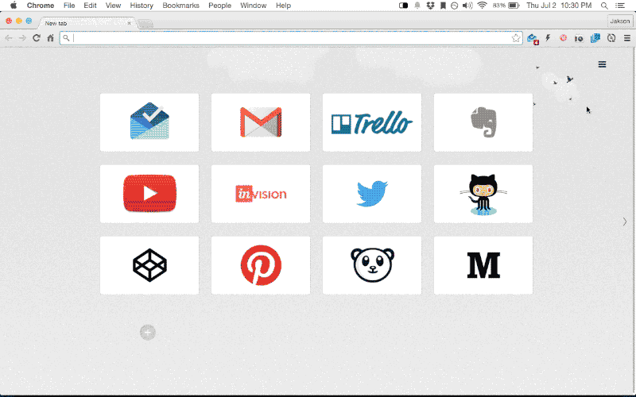

#Multlinks Shortcut
##Open several webpages at once. It's simple and easy.

##Troubleshooting
###1. The shortcut is not working on Google Chrome
Sometimes google chrome doesn't bind correctly the shortcut, once it just do this on the first installation. You can bind yourself a new shortcut by click in *Keyboard shortcuts* at the end of the extensions page list or going in [this url](chrome://extensions/configureCommands).

Get the extensions at [Chrome Web Store](https://chrome.google.com/webstore/detail/ddfoagnhebpbidjkganhgninciiecgon).

##Feedback
If you find a bug, please report it by [clicking here](https://github.com/jrochelly/multilinks/issues).

You can contact me on [jrochelly@gmail.com](mailto:jrochelly@gmail.com)
